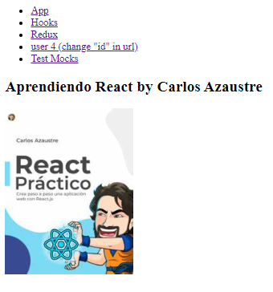
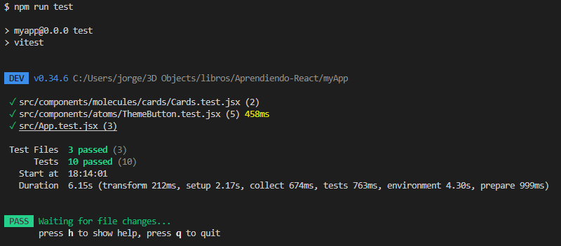
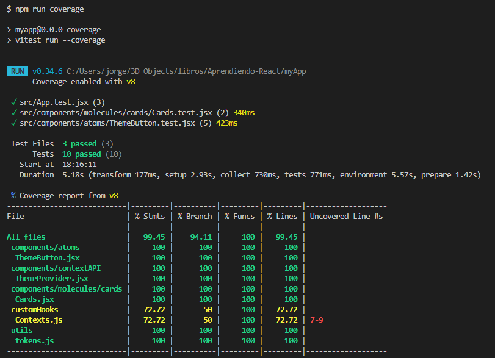
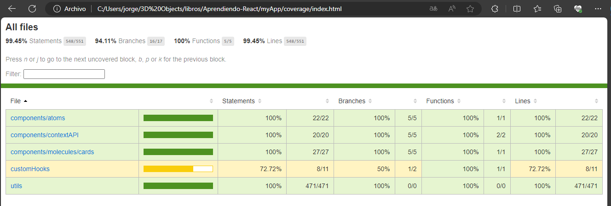

# React + Vite: Aprendiendo React con Carlos Azaustre y React desde Cero de Udemy

Este proyecto consiste en una aplicación sencilla desarrollada con React y el conjunto de herramientas de front-end ViteJS. Aunque no se han aplicado estilos, se han implementado varios conceptos y conocimientos adquiridos del libro "Aprendiendo React" de Carlos Azaustre y del curso "React desde Cero" de Udemy.

Durante el desarrollo de la aplicación, se practicó el uso de `useState`, `useContext` y varios hooks de React. También se crearon hooks personalizados y se trabajó con las bibliotecas Redux y Redux Toolkit. Además, se utilizó la biblioteca `react-router-dom` (versión 6) para la gestión de rutas.

Para las pruebas, se utilizó Vitest en combinación con React Testing Library. Este enfoque permitió validar el correcto funcionamiento de los distintos componentes y funcionalidades de la aplicación.

## Imagen de la APP

## Imagen de los Test en terminal

## Imagen de la cobertura de los test en terminal

### Imagen del archivo index.html generado en coverage/
